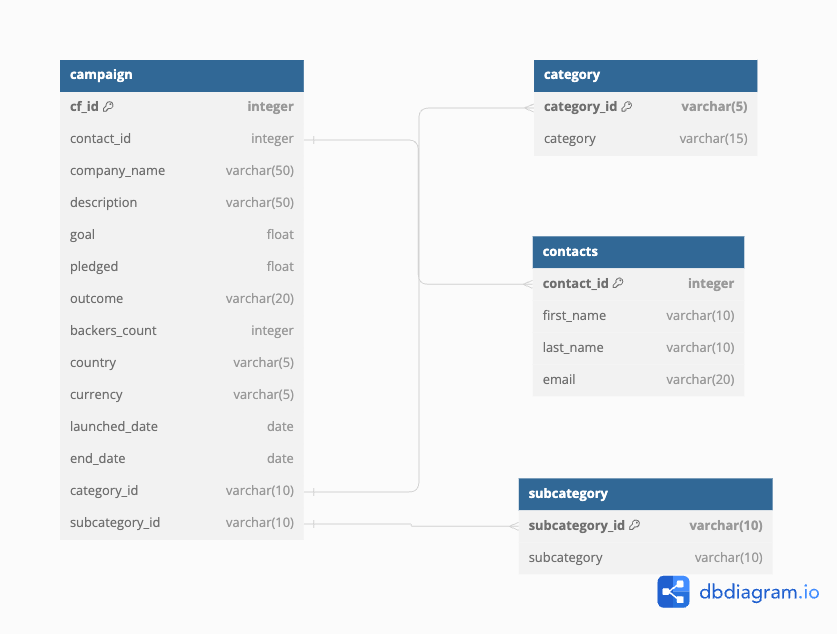
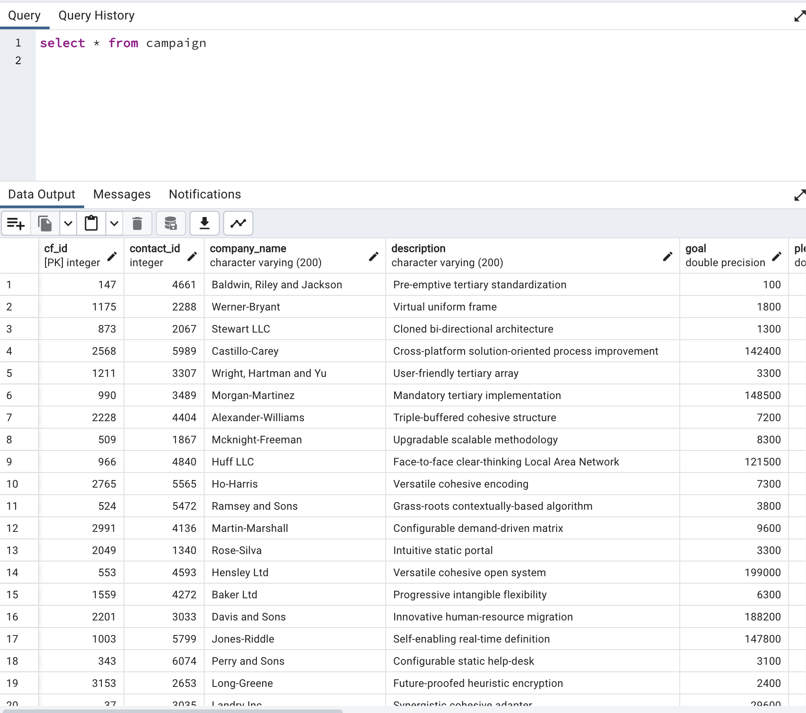
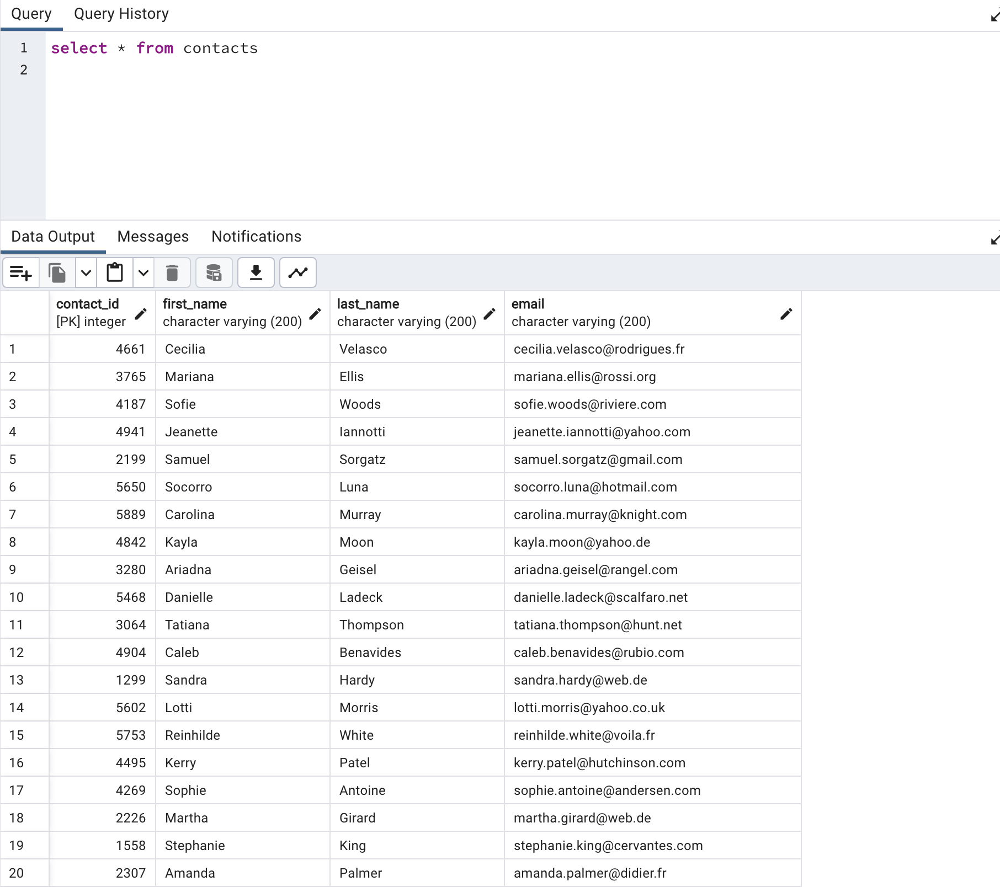

# Crowd Funding ETL
Columbia University Bootcamp Project 2  

  

## About 
This project demonstrates the steps of the ETL pipeline. ETL stands for Extract, Transform and Load. Using crowd funding data, we explore three big skills in the data analysis field.  
All together we used python and its libraries (pandas, datetime, json), and Postgre SQL(PG Admin 4) to carry out all tasks. 

## Table of contents
[Installation](#installation)  
[ETL](#etl)  
[Database](#database)  
[DB Schema](#schema)  
[Acknowledgements](#acknowledgements)  

## Installation
    1. Clone repository on local machine. 
    2. Open ETL_Mini_Project_starter_code.ipynb file. 
    3. Run all cells. 
    4. Open PG Admin 4.
    5. Create Database.
    6. Go to Query Tool. 
    7. Import crowdfunding_db_schema.sql file. 
    8. Run commands.
    9. Import tables in order: category.csv, subcategory.csv, contacts.csv, campaign.csv

## ETL

## Database
  

For the database we choose PostgreSQL.  

### Schema
  

Our database consisted of 4 different tables:  
    - campaign  
      
    - contacts  
      
    - category  
      
    - subcategory  
      

## Acknowledgements
- How to change datatype to datetime: [Youtube](https://www.youtube.com/watch?v=eirjjyP2qcQ&t=1092s&ab_channel=CoreySchafer)  

